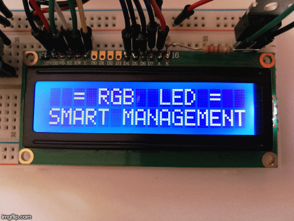
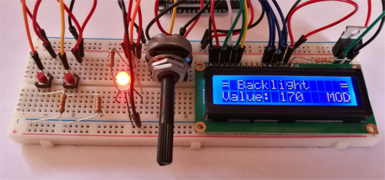
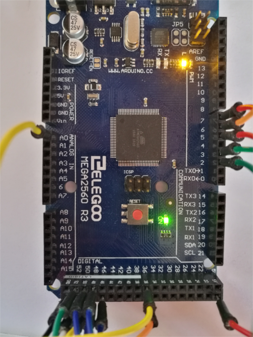

# Lightweight SMART Control System

by *Massimo Clementi*

## What is this project about?

This project is a simple and fully customisable stand-alone device which allow the user to control a set of electronic outputs. The development of a compact and optimised system is crucial to exploit at their best the available input devices.

In this project the *SMART Control System* let the user full control on the intensity and the hue of the RGB led and make it possible to manage the brightness and the contrast of the LCD display. The device implements a simple and easy-to-customize user interface, with different menus and output values to set.

## Setting up

From the `.ino` file you can look and customise the input and output pins. Feel free to add as many output pins as you like. Here is the default setting for my Arduino Mega:

	== PIN SETUP ==
		
	LCD:
	  (digital OUT)		(PWM OUT)
	  RS on pin 53		CONTRAST on pin 2
	  RW on pin 52		BACKLIGHT on pin 3
	  E on pin 51
	  D4 on pin 50
	  D5 on pin 49
	  D6 on pin 48
	  D7 on pin 47
	
	RGB LED:
	  (PWM OUT)
	  RED on pin 5
	  GREEN on pin 6
	  BLUE on pin 7
	
	BUTTONS:
	  (digital IN)
	  BUTTON 1 on pin 37
	  BUTTON 2 on pin 36
	
	POTENTIOMETER:
	  (analog IN)
	  POT_IN on pin A0

For the breadboard electrical scheme remember to add pull-down resistors to the buttons and to use transistors to control the output lines.

## How does it work?

When you first turn on the Arduino, the message `RGB LED Smart Management` will be displayed on the LCD. After 2 seconds the main menu will be shown and the user can start using the device.

Quick press `BUTTON 1`  to browse cyclically through the menu items, quick press `BUTTON 2` to select the current item and long press `BUTTON 1` to return to the main menu.

Once selected a specific item of the main menu, the respective output value will be displayed (in read-only mode). To enter the *edit-mode* and change the value just press again `BUTTON 2` and  `MOD` will appear in the right bottom corner. Choose the desired value with the potentiometer and confirm it quick pressing `BUTTON 2`. The configuration of other output values can be carried out returning to the main menu (long press `BUTTON 1`).

Thank you and customize the code as long as you need!

---

## Additional photos

Main image of the system:

Arduino Mega board:

